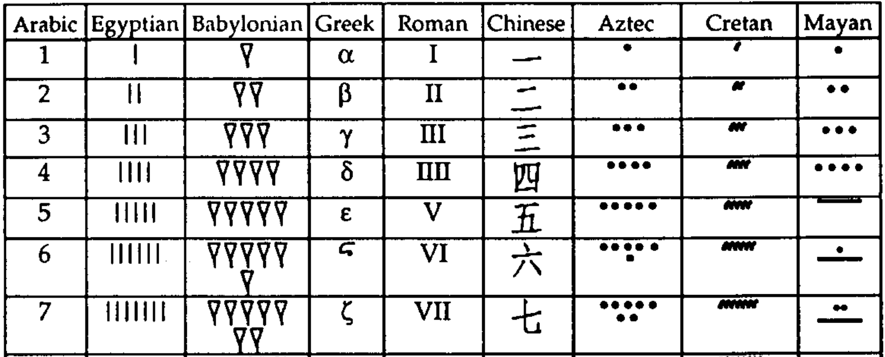
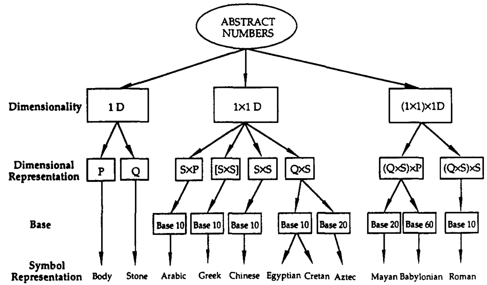

# The Main Idea

An API is a computational **representation** of real-world concepts. Representations are mappings between elements of a represented world (e.g. a primary color) and a representing world (e.g. an enum in a programming language). A concept can have many representations &mdash; for instance, a number can be expressed many ways:

<center>
    <br />
    <i>Zhang and Norman, <a href="https://www.academia.edu/download/51476691/A_Representational_Analysis_of_Numeratio20170123-25558-8fmkpj.pdf">A Representational Analysis of Numeration Systems</a>. 1996</i>
</center>

As an API designer, your goal is to pick a representation that best supports its intended tasks. For example, a number representation should make it easy to add and multiply two numbers.

A skilled API designer can design representations _systematically_, understanding the structure of representations that makes tasks easier or harder. For example, numbers can be categorized along a few dimensions:

<center>
    <br />
</center>

Using this taxonomy, we can understand that all 1D systems (like tally marks) make addition easier, because addition reduces to concatenating strings (e.g. II + I = III). However, 1x1D systems (like Arabic numerals) make multiplication easier &mdash; see [the paper](https://www.sciencedirect.com/science/article/pii/0010027795006743) for why.


> If you're interested in learning more about representation theory in cognitive psychology, I strongly recommend [Things That Make Us Smart](https://www.amazon.com/Things-That-Make-Smart-Attributes-ebook/dp/B00QFJHP94) by Don Norman.

In this book, my goal is to show you how representational principles can be used to improve API design. That is, when you map the real world to an API, how can you help API clients be more productive and avoid mistakes?

<!-- and **a good API has a small distance between the representation and the concept**. This begs the question: what defines such a distance? -->

## Principles of representation: cardinality mismatch

Consider the example from the last chapter. We want to define a data type that represents the three primary colors. We could do this as either a string or an enum:

```rust,ignore
fn color_to_rgb_bad(color: &str) // ...

enum PrimaryColor { Red, Yellow, Blue }
fn color_to_rgb_good(color: PrimaryColor) // ..
```

Here, an enum is preferable to a string because **there is a one-to-one map from elements of the representation to elements of the concept**. By contrast, the type `&str` includes many more strings than primary colors. Because `&str` is not one-to-one, the `color_to_rgb_bad` function must handle the additional case of elements in the representation that don't exist in the concept.

Previously, we justified the enum design in terms of potential errors avoided. But the point is that these errors are symptoms of a deeper issue: cardinality mismatch. And when we explicitly articulate this principle, then we can more easily apply it to new situations.

For example, cardinality mismatch can happen in multiple ways: consider a situation where an API's representation might contain _fewer_ elements than those in the concept. Consider a variant of Rust's [`fs::read_to_string`](https://doc.rust-lang.org/std/fs/fn.read_to_string.html) function which returns a `bool` instead of `Result<String, io::Error>`.

```rust
use std::{io::Read, path::PathBuf, fs::File};
fn read_to_string(path: String, buffer: &mut String) -> bool {
  let mut file = if let Ok(f) = File::open(PathBuf::from(path)) {
    f
  } else {
    return false;
  };

  if !file.read_to_string(buffer).is_ok() {
    return false;
  }

  return true;
}
```

In this API design, the `bool` represents the concept of success or failure. However, I/O can fail for a number reason, e.g. if the file is not found or the user does not have read permission. The `Result` representation has a one-to-one mapping because `io::Error` has a separate value for each I/O error, while the `false` value must represent every I/O error. The consequence of the `bool` design is that the client cannot distinguish between failure cases given a return value of `false`.

## The main idea: consistency between related elements

This main idea of this book is a principle of representation: **consistency between related elements**. In a system with many parts, it's often important that certain pieces be in sync with each other. For example:
* In an event listener, the event name (e.g. `"click"`) must be consistent with the event parameters (e.g. `mousex`).
* In a state machine, the machine's state (e.g. `FileOpen`) must be consistent with the set of actions permissible on the machine (e.g. `.close()`).
* In a function with variadic arguments, the order of arguments (e.g. `route("/:user/:message")`) must be consistent with the order of usage (e.g. `|u: User, m: Message|`).

> Another way of interpreting this principle is "when multiple components must agree on aspects of an entity", which is known as [connascence](https://practicingruby.com/articles/connascence).

Enforcing consistency is often easier in a **closed system**, where every piece is defined and no further ones can be added. For example, consider an (inefficient) event system with a fixed set of events:

```rust
enum Event {
  Click { mousex: usize, mousey: usize },
  KeyPress { keycode: usize }
}

struct EventSystem {
  listeners: Vec<Box<dyn FnMut(Event) -> ()>>
}

impl EventSystem {
  fn add_listener(&mut self, f: impl FnMut(Event) -> () + 'static) {
    self.listeners.push(Box::new(f));
  }
}

fn example() {
  let mut events = EventSystem { listeners: Vec::new() };
  events.add_listener(|e| {
    if let Event::Click { mousex, mousey } = e {
      println!("Clicked: x={}, y={}", mousex, mousey);
    }
  });
}
```

The nature of Rust's `enum` enforces that if a `Click` event occurred, then (and only then) will the listener be able to access the `mousex` field. However, what if an API client wanted to add another event to the system? They cannot reach into the API and add another enum variant.

Therein lies the core technical challenge: how can an API enforce consistency between related elements in an open system? Over the next few chapters, you'll learn how careful use of Rust's type system can achieve both of these goals.
